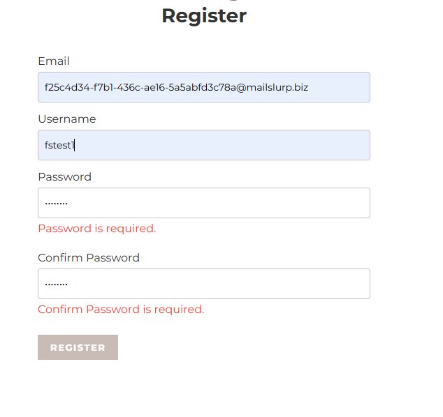

# BUG_REPORT.md

## Test info

- ### OS - Windows 11 Home (24H2)
- ### Browser - Microsoft Edge

---

## Manual testing BUGS

**1. Registracija korisnika korištenjem FILL**

- **Steps:** Menu -> Register -> U polje email ili username upotrijebiti "Saved info - last used" popup
- **Expected results:** Izabrani spremljeni podaci su odabrani te možemo nastaviti s unosom ostalih podataka za registraciju
- **Actual results:** Izabrani spremljeni podaci su odabrani, crvenim tekstom forma traži unos usernamea, pw iako je forma ispunjena. Button register je blokiran.

- **Priority:** LOW
- **Severity** Minor - UX neugodnost

---

**2. Registracija korisnika - provjera/otkrivanje lozinke**

- **Steps:** Menu -> Register -> Unos lozinke -> Klik van input fielda za password
- **Expected results:** Show/hide password gumb treba ostati vidljiv i upotrebljiv
- **Actual results:** Gumb nestane
- **Priority:** LOW

---

**3. Malfunction web stranice**

- **Steps:** Ponoviti korake iz 1. opisanog BUG-a -> Pritisnuti MENU button ili logo ispod MENU gumba
- **Expected results:** Povratak na HOME page te mogućnost nastavljanja navigacijom web stranice
- **Actual results:** MENU gumb prestaje raditi, albumi drugih korisnika se ne prikazuju pri scrollanju dolje. Search bar prestaje raditi.
- **Priority:** HIGH
- **Severity** Major - prestanak funkcionalnosti web stranice

---

**2. Registracija korisnika - provjera/otkrivanje lozinke**

- **Steps:**
- **Expected results:**
- **Actual results:**
- **Priority:**
