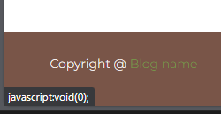

# BUG_REPORT.md

## Test info

- ### OS - Windows 11 Home (24H2)
- ### Browser - Microsoft Edge

---

## Manual testing BUGS

**1. Registracija korisnika korištenjem FILL (Last saved info)**

- **Steps:** Menu -> Register -> U polje email ili username upotrijebiti "Saved info - last used" popup
- **Expected results:** Izabrani spremljeni podaci su odabrani te možemo nastaviti s unosom ostalih podataka za registraciju
- **Actual results:** Izabrani spremljeni podaci su odabrani, crvenim tekstom forma traži unos usernamea, pw iako je forma ispunjena. Button register je blokiran.

- **Priority:** LOW
- **Severity:** Minor - UX neugodnost

---

**2. Registracija korisnika - provjera/otkrivanje lozinke**

- **Steps:** Menu -> Register -> Unos lozinke -> Klik van input fielda za password
- **Expected results:** Show/hide password gumb treba ostati vidljiv i upotrebljiv
- **Actual results:** Gumb nestane
- **Priority:** LOW
- **Severity:** Minor - UX neugodnost

---

**3. Malfunction web stranice**

- **Steps:** Ponoviti korake iz 1. opisanog BUG-a -> Pritisnuti MENU button ili logo ispod MENU gumba
- **Expected results:** Povratak na HOME page te mogućnost nastavljanja navigacijom web stranice
- **Actual results:** MENU gumb prestaje raditi, albumi drugih korisnika se ne prikazuju pri scrollanju dolje. Search bar prestaje raditi.
- **Priority:** HIGH
- **Severity:** Major - prestanak funkcionalnosti web stranice

---

**4. Oporavak lozinke**

- **Steps:** Menu -> Login -> Klik na "Forgot your password? Recover your password here!" -> Unos postojeće email adrese -> Klik Recover Password gumb
- **Expected results:** Routanje na stranicu za oporavak lozinke
- **Actual results:** 404 Error page

- **Priority:** MEDIUM
- **Severity:** Major - Funkcionalnost za oporavak korisničkog računa, ozbiljni problem za Customer Support

---

**5. Nemogućnost pregleda neparnih uploadanih slika u albumu**

- **Steps:** (Pretpostavka da je korisnik prijavljen i već ima album i sliku) -> MENU -> Profile -> Klik na album -> Klik na pregled prve/treće/pete...(neparni grid) slike u albumu

| 1.  | 2.  | 3.  |
| --- | --- | --- |
| 1   | 2   | 3   |
| 4   | 5   | 6   |
| 7   | 8   | 9   |

- **Expected results:** Pregled slike
- **Actual results:** 404 Image missing

- **Priority:** HIGH
- **Severity:** Major - Osnovna funkcionalnost/svrha aplikacije, pregled slika

---

**6. Uploadanje slike s postojećim imenom**

- **Steps:** (Pretpostavka da je korisnik prijavljen i već ima album i sliku) -> MENU -> Profile -> Klik na album -> Upload photo -> Upload image -> (Photo name je isti kao i prethodna slika) -> Upload
- **Expected results:** Upozorenje da je ime slike isto, mogućnost promjene imena slike te obaviti upload
- **Actual results:** Upozorenje da je ime slike isto, sliku nije moguće uploadati iako je ime promjenjeno, upozorenje ostaje

- **Priority:** LOW
- **Severity:** Medium - Utječe na osnovnu funkcionalnost, korisnik može zaobići ponovnim uploadom i promjenom imena prije pritiska Upload

---

**7. Polje za unos lozinke se ne resetira / nestanak gumba za otkrivanje lozinke**

- **Steps:** MENU -> Login -> Unos emaila/kor. imena -> Unos netočne lozinke
- **Expected results:** Upozorenje da je lozinka netočna, unos (input field) se briše ILI korisnik može otkriti lozinku sa Show password gumbom
- **Actual results:** Upozorenje da je lozinka netočna, unos lozinke ostaje i gumb za otkrivanje lozinke nestaje

- **Priority:** LOW
- **Severity:** Minor - UX neugodnost

---

**8. Footer copyright link**

- **Steps:** MENU -> Klik na (Copyright @) Blog Name u footeru
- **Expected results:** Link vodi na stranicu autora/firme
- **Actual results:** Ne događa se ništa

- **Priority:** LOW
- **Severity:** Minor - UX neugodnost, neispravnost HTML-a, korisnik očekuje nešto svojim klikom

---

**9. Social Login neispravnost**

- **Steps:** MENU -> Login -> Klik na bilo koji Social Login gumb
- **Expected results:** Link vodi na stranicu/popup za prijavu s društvenom mrežom
- **Actual results:** Ne događa se ništa / Console -> Error 400 Bad request

- **Priority:** LOW
- **Severity:** Minor - UX neugodnost, neispravnost HTML-a, korisnik očekuje nešto svojim klikom
